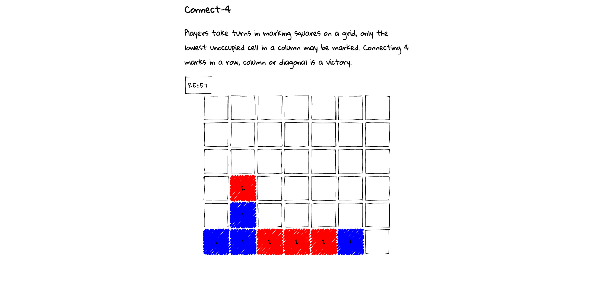
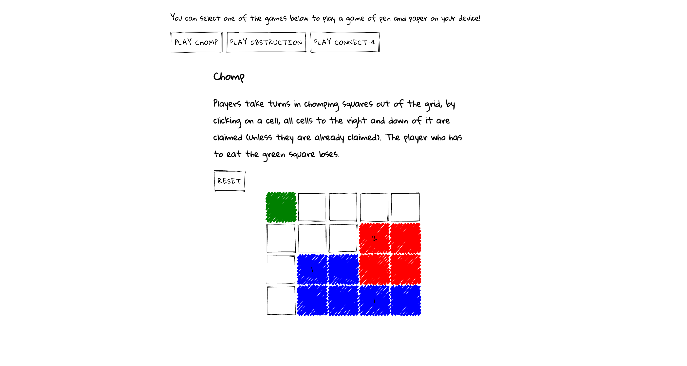
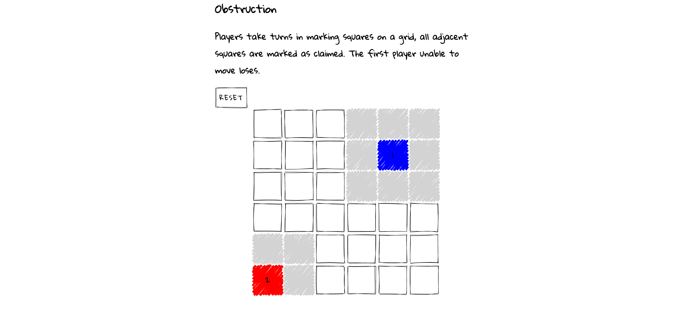

## Project title
A collection of pen and paper games that can be played in the browser - saving a couple pieces of paper here and there.

## Motivation
Built to explore HTML, CSS, JS without libraries to see what is possible to achieve in a short time with limited resources. Happy to receive any feedback/comments/suggestions.

## Build status
Complete for now. Could extend by creating more games to add to the collection.

## Screenshots

## Tech/framework used
- HTML
- Sass
- Vanilla JS

## Features
First real project!

## Tests
npm test (jest)